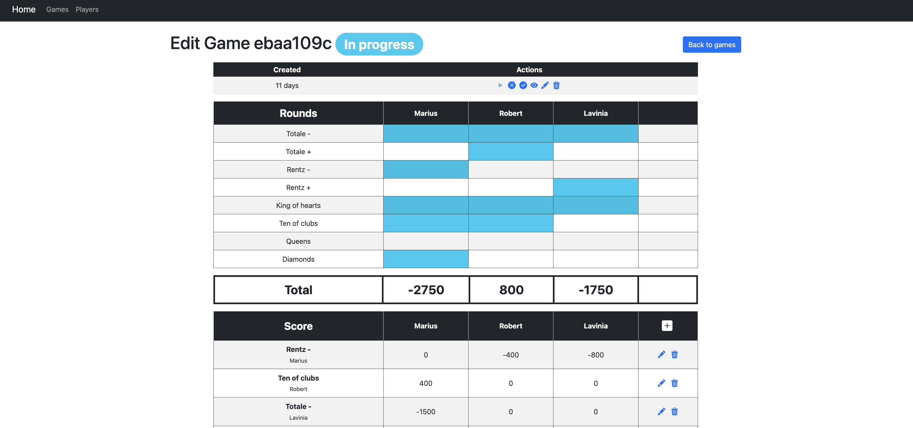
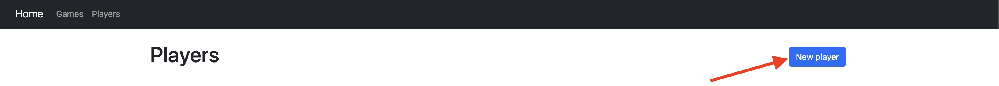
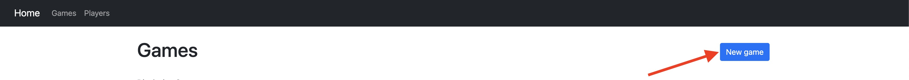
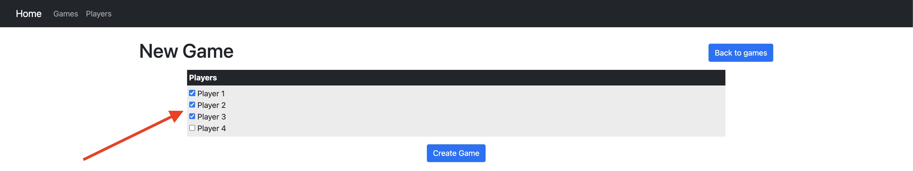
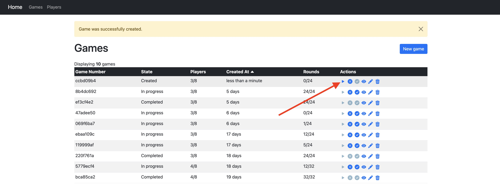
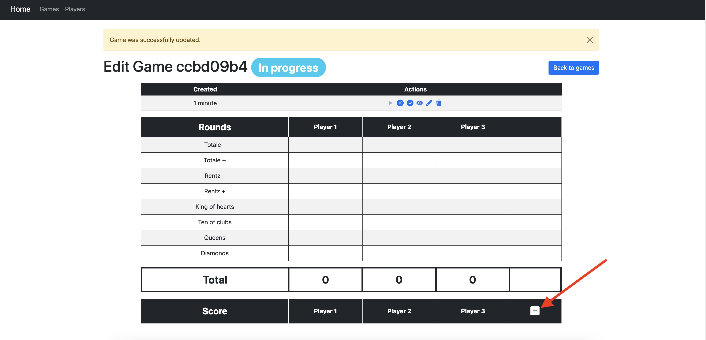
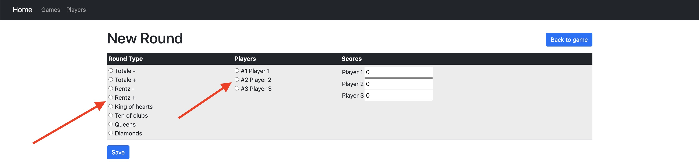
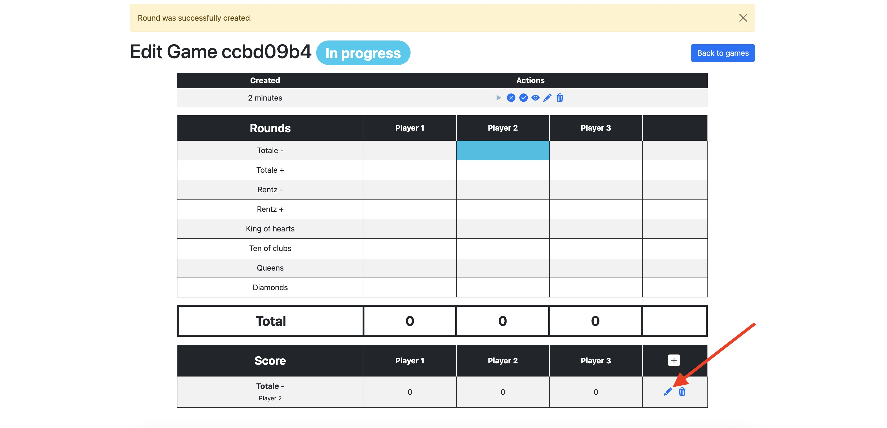
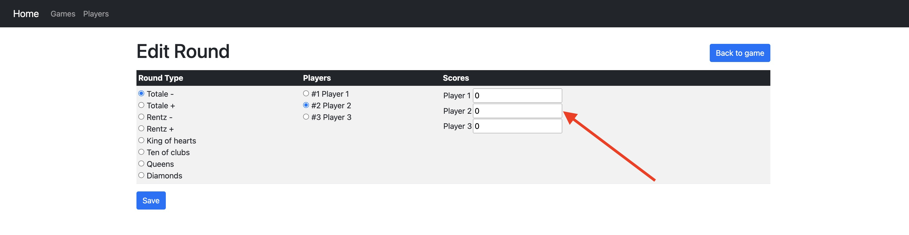
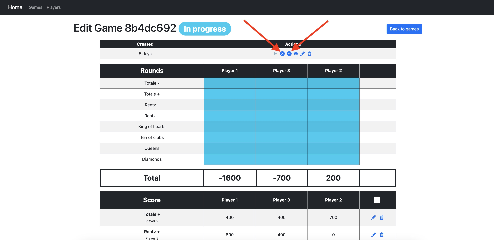

# Game-stats


## About

Web aplication used for keeping score of `rentz` card game, also it will provide statistics about games, players and scores saved in the database.

It was created with Ruby on Rails (Ruby 3.2.2 and Rails 7.0.8) using as database PostreSQL.

## Setup
1. Clone the repository.
1. Go to the [Rbenv](https://github.com/rbenv/rbenv) and folow the installation steps of Ruby.
1. To verify that Ruby is installed correctly, open a terminal window and type the following command:
    ```sh
    ruby -v
    ```
1. To install Rails type in your terminal window the following command
    ```sh
    gem install rails -v 7.0.8
    ```
1. Go to the [PostgreSQL website](https://www.postgresql.org/download/). Download the appropriate PostgreSQL installer for your operating system and folow the instalation steps.
1. Install bundler:
    ```sh
    gem install bundler
    ```
1. Install the project's dependencies:
    ```sh
    bundle install
    ```
1. Create and setup the database:
    ```sh
    rails db:create
    rails db:migrate
    ```
1. Add seeds if needed.
    ```sh
    rails db:seeds
    ```
1. Open server:
    ```sh
    rails s
    ```
1. Open application in browser at: [Game-stats](http://localhost:3000)

## Usage

* Create players.


* Create game and add the players.



* Start the game.


* Start round.


* Choose round_type and player


* Input score on every round by editing the round on the score table.



* Complete or cancel the game


## Work in progress

I will next implement `hotwire` to be more efficient on using it.
